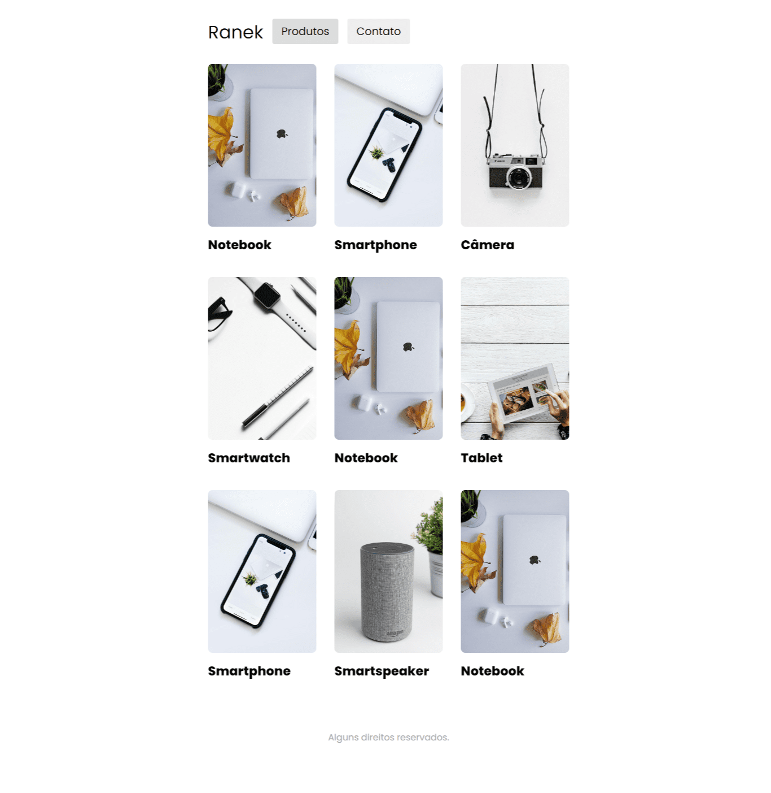

## Ranek

## Layout

## Available Scripts

In the project directory, you can run:

### `npm start`

Runs the app in the development mode.\
Open [http://localhost:5173](http://localhost:5173) to view it in your browser.